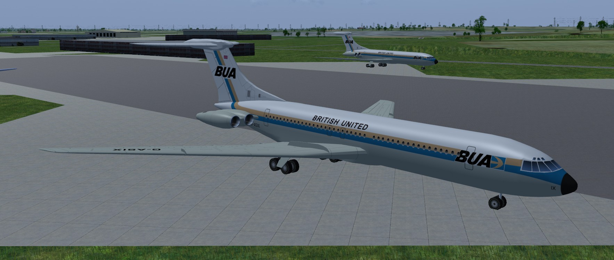
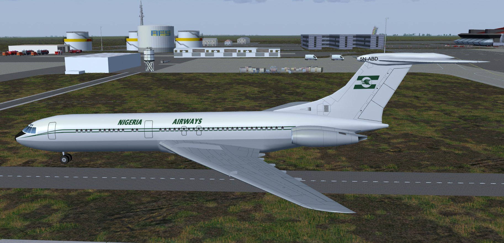

# Vickers VC-10
### AI Aircraft for FlightGear

Download the zip file and extract the "vc-10" folder into the "$FG_ROOT/AI/Aircraft" folder.

To use you will need to create a traffic file, see the wiki for instructions.
 http://wiki.flightgear.org/AI_Traffic

There is a simple AI Traffic Creator here: 
https://github.com/gooneybird47/FlightGear-AI-Traffic-Creator